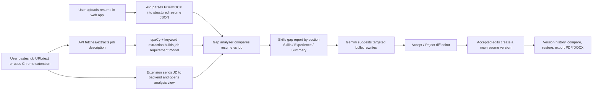

# ResumePR

ResumePR is an AI-assisted resume tailoring platform built as a monorepo. It combines a React web app, a FastAPI API, and a Chrome extension to turn job descriptions into targeted, reviewable resume improvements.

## Repo Structure

```text
ResumePR/
|-- apps/
|   |-- api/          FastAPI backend, AI services, parsing, analysis, export
|   |-- web/          React + Vite + Tailwind web app
|   `-- extension/    Chrome extension for job description capture
|-- .env.example      Shared environment variable reference
|-- package.json      Root helper scripts for local development
|-- README.md
`-- vercel.json       Repo-root Vercel rewrite config
```

## How It Works



## Core Product Flow

1. The user uploads a resume in PDF or DOCX format.
2. The API parses the file into structured resume JSON.
3. A job description is ingested from a pasted URL, raw text, or the Chrome extension.
4. The backend extracts requirements, skills, title, company, and qualification signals.
5. The gap analysis engine scores the resume by section and identifies missing keywords.
6. Gemini generates safe, targeted rewrite suggestions for existing bullets only.
7. The user accepts or rejects each change independently in a PR-style diff editor.
8. Accepted edits are saved as a new version with metadata and can be compared or exported.

## Apps

### `apps/api`

Owns:

- Resume upload and parsing
- Job description ingestion and keyword extraction
- Skills gap analysis
- Gemini suggestion generation
- Version history, restore, and export
- Firebase token verification and user-scoped data access

### `apps/web`

Owns:

- Resume upload UI
- Job input and analysis screens
- Gap analysis center panel
- Accept/reject diff editor
- Version history, export modal, and auth flows

### `apps/extension`

Owns:

- Active job page extraction
- Popup-based handoff to the backend
- Browser-side sync into the web app flow

## Local Development

### 1. Clone and enter the repo

```bash
git clone https://github.com/Whauv/ResumePR.git
cd ResumePR
```

### 2. Configure environment variables

Copy these templates and fill them in:

- `.env.example`
- `apps/api/.env.example`
- `apps/web/.env.example`

### 3. Start the API

```bash
cd apps/api
python -m venv .venv
.venv\Scripts\activate
pip install -r requirements.txt
python -m spacy download en_core_web_sm
uvicorn main:app --reload
```

API default URL: `http://127.0.0.1:8000`

### 4. Start the web app

```bash
cd apps/web
npm install
npm run dev
```

Web default URL: `http://127.0.0.1:5173`

### 5. Load the Chrome extension

1. Open `chrome://extensions`
2. Enable Developer Mode
3. Click `Load unpacked`
4. Select `apps/extension`

## Root Scripts

The root `package.json` includes convenience commands:

```bash
npm run install:web
npm run dev:web
npm run build:web
npm run preview:web
npm run dev:api
```

## Environment Variables

### Shared

- `GEMINI_API_KEY`
- `FIREBASE_SERVICE_ACCOUNT_JSON`
- `PORT`
- `VITE_API_URL`
- `VITE_FIREBASE_CONFIG`

### API

- `GEMINI_API_KEY`
- `FIREBASE_SERVICE_ACCOUNT_JSON`
- `PORT`

### Web

- `VITE_API_URL`
- `VITE_FIREBASE_CONFIG`

`VITE_FIREBASE_CONFIG` should be a JSON string containing your Firebase web config.

## Firebase Setup

1. Create a Firebase project.
2. Enable Authentication.
3. Turn on Email/Password.
4. Turn on Google sign-in.
5. Create a web app and copy the config into `VITE_FIREBASE_CONFIG`.
6. Generate a service account key.
7. Put the full JSON into `FIREBASE_SERVICE_ACCOUNT_JSON`.

## Gemini Setup

1. Open Google AI Studio.
2. Create a Gemini API key on the free tier.
3. Set it as `GEMINI_API_KEY`.

## Deployment

### Frontend on Vercel

Two deployment options are supported:

- Deploy the repo root using the root `vercel.json`
- Deploy `apps/web` directly using `apps/web/vercel.json`

Set:

- `VITE_API_URL`
- `VITE_FIREBASE_CONFIG`

### Backend on Railway or Render

Use:

- `apps/api/Dockerfile`
- `apps/api/Procfile`

Set:

- `GEMINI_API_KEY`
- `FIREBASE_SERVICE_ACCOUNT_JSON`

## Architecture Diagram

```text
apps/extension
    |
    | DOM extraction + popup sync
    v
apps/web ---------------------------> apps/api -------------------------> SQLite
    |                                     |                                |
    | upload, review, history, export     | parsing, NLP, Gemini, auth     | resumes, jobs,
    |                                     |                                | analyses, versions
    +------------------------- authenticated API requests -----------------+
```

## Key Features

- Resume upload and structured parsing for PDF and DOCX
- Job description ingestion from URL, raw text, or extension capture
- Section-level skills gap analysis instead of a single ATS score only
- PR-style accept/reject AI diff editor for bullet rewrites
- Resume version history with compare, restore, and export
- Firebase-authenticated, user-scoped data model

